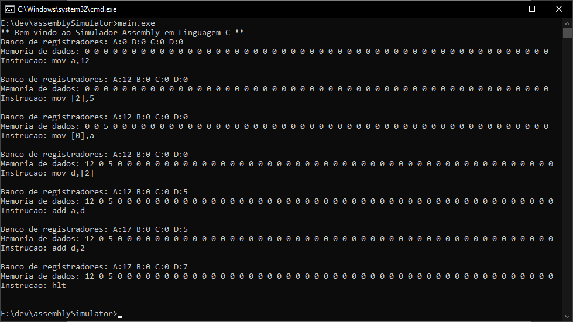

# Simulador Assembly

> Um mini simulador de código Assembly escrito em C, realizado para uma avaliação da Universidade Federal do Agreste de Pernambuco.



## Execução

### Ubuntu:

Instalação do gcc

```sh
sudo apt install gcc -y
```

Compilação e execução

```sh
gcc main.c -o main
./main
```

### Windows:

Realizar a instalação do gcc previamente por meio do MinGW.

Compilação e execução

```sh
gcc main.c -o main.exe
main.exe
```

## Como usar

Esse mini simulador tem 7 funções para serem usadas:

-   **mov** _registrador_,_constante_
    -   move uma constante para um registrador
-   **mov** _endereço de memória_,_constante_
    -   move uma constante para um endereço de memória
-   **mov** _endereço de memória_,_registrador_
    -   move um registrador para um endereço de memória
-   **mov** _registrador_,_endereço de memória_
    -   move um endereço de memória para um registrador
-   **add** _registrador_,_registrador_
    -   soma um registrador com outro registrador
-   **add** _registrador_,_constante_
    -   soma um registrador com uma constante
-   **hlt**
    -   encerra o programa

## Histórico de lançamento

-   1.1.0
    -   ADD: Adição do README.md.
-   1.0.2
    -   FIX: Resolvido erro que encerrava o código ao tentar somar um registrador com uma constante.
-   1.0.1
    -   FIX: Deletado um printf perdido dentro da função mov.
-   1.0.0
    -   Versão pronta para lançamento.

## Meta

Thiago Torres – [@akiratorres\_](https://twitter.com/akiratorres_) – torres.thg@gmail.com

Distribuído sob a licença MIT. Veja `LICENSE` para mais informações.

[https://github.com/akiratorres/assemblysimulator](https://github.com/akiratorres/assemblysimulator)
